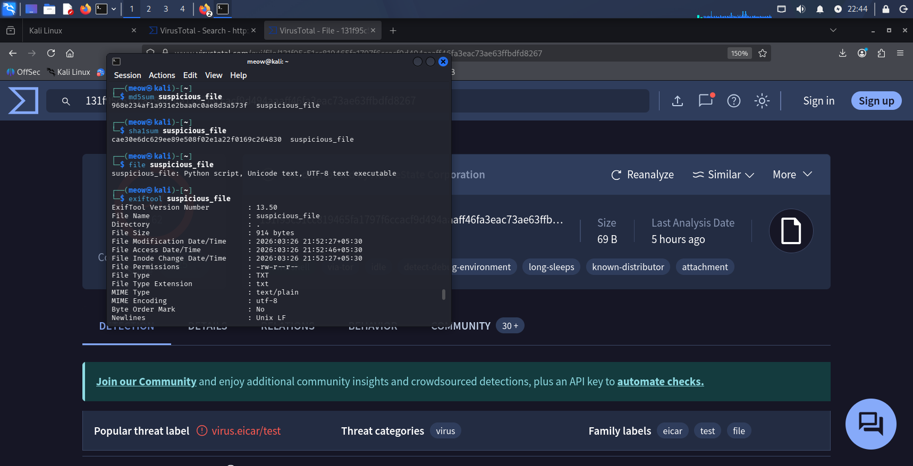
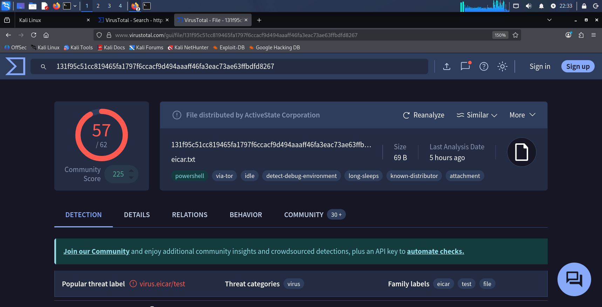

# suspicious_file-_analyse
# 1. Hash them
sha256sum fake_malware_sample.py suspicious_strings_sample.txt

# 2. Check file type
file fake_packed.bin

# 3. Extract strings
strings suspicious_strings_sample.txt
strings fake_malware_sample.py

# 4. Check entropy
binwalk -E fake_packed.bin

# 5. Upload EICAR to VirusTotal
sha256sum eicar_test.com

